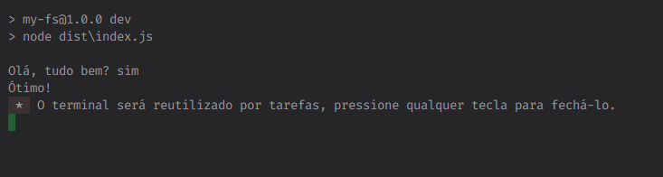

<div align='center'>
    <h1>Node Read Line</h1>
    <p>Não imaginei que eu faria isso com o Node</p>
</div>

[](https://github.com/Andrey20Allyson/node-read-line/blob/main/LICENSE)

```ts
import { Scanner } from './scanner';

async function main() {
    let resp: string = await Scanner.next('Olá, tudo bem? ');

    if (resp.toLowerCase() === 'sim') {
        console.log('Ótimo!');
    }
}

main();
```

<div align='center'>
    
</div>

# Sobre o Projeto

Esse projeto tem o intuito de fornecer uma interface de **"user inputs"** fácil de ser utilizada e implementada!

## Ideia inicial

Projetos em Java, C/C++ e Python todos possuem algo em comum, uma maneira simples de pegar dados do `stdin` e tratar-los posteriormente. Porem já o Javascript com NodeJS não possui uma interface tão simples de se compreender quando se está iniciando na programação com Javascript.

## O problema

O NodeJS possui uma biblioteca padrão chamada `process` que permite a obtenção dos argumentos (argv) enviados na chamada do processo, manipulação de I/O por meio do `stdin` & `stdout` possibilitando que a criação de aplicações de prompt.